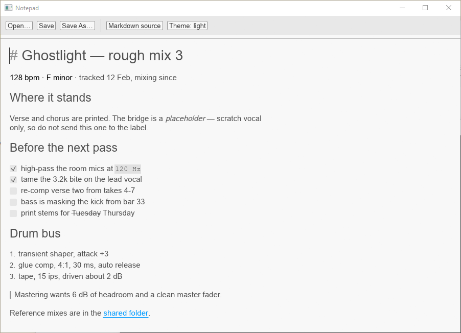
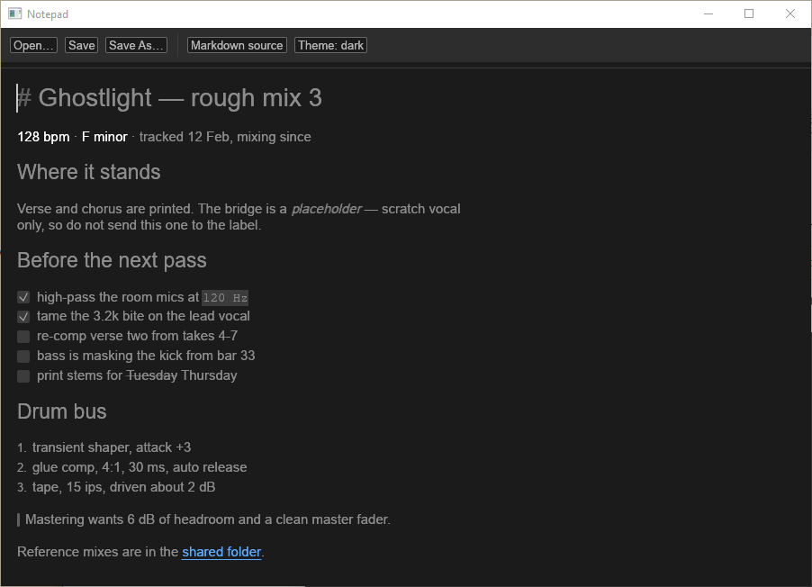

# A vibe-coded VST3 Notepad effect

You compose and produce: you have notes on your projects. You're probably keeping them in text files in some folder, maybe even managed using Obsidian or something. But let's be honest: why?

Not the notes part, that part makes perfect sense, but why would your notes need to live separately from your actual project?





## "My DAW doesn't let me s-"

No, no, no, I'm not talking about a project setting, I'm talking about literally adding your notes to your project. Using a notepad effect on your master.

Think FL Studio's "Fruity Notepad" or Melda Production's MNotepad.

### "Yeah but those are... kind meh? I don't use FL Studio, and MNotepad is small and crowded?"

True. They also don't support markdown, and let's be real. Notes in plain text? Seriously? In `{insert year here}`? Let's write our notes in Markdown instead, with inline editing (i.e. you see markdown if your cursor is on something with markdown syntax, and just "the text" if it's not).

Hell let's just Star Trek that: "Computer, make me a VST3 note-taking effect plugin that supports markdown".

Oh look: it did the thing.

# Installing the plugin

## Downloads are [here](https://github.com/Pomax/vst-notepad/releases)

As this is a VST3 release, there's only Windows and a MacOS releases, because Linux does not support VST3. If you're on Linux, have a look at https://github.com/robbert-vdh/yabridge, which might work for you.

## Installation is a file copy

VST3, unlike VST/VST2, has only one top level location it's allowed to go in, to prevent the absolutely bullshit that VST2 had with "everything drops plugins in different dirs good luck lol".

### Windows

Put the vst3 file in `C:\Program Files\Common\VST3` (either top level, or you can put it in its own folder inside of that), then tell your DAW to rescan for plugins.

### MacOS

Put the vst3 "file" in `/Library/Audio/Plug-Ins/VST3/` (either top level, or you can put it in its own folder inside of that), then tell your DAW to rescan for plugins.

Note that MacOS technically has two locations, because unlike Windows it has a proper "system vs user" file system. So `~/Library/Audio/Plug-Ins/VST3/` also works. Same dir, just the `user` version (i.e. just for you) rather than the `system` version (i.e. for all users).

#### "Apple could not verify Notepad.vst3 is free of malware"

You will get this, and it is not a sign that anything is wrong with the download.

The plugin is code-signed, but it is not *notarised*: notarisation means uploading every build to Apple for scanning, which requires a paid Apple Developer account. This is a free plugin, so it doesn't have one. Anything you download from the internet gets flagged with a `com.apple.quarantine` attribute, and for un-notarised code MacOS refuses to load it and offers you the Trash.

Clear the flag on the copy you installed and the dialog goes away for good:

```bash
xattr -dr com.apple.quarantine ~/Library/Audio/Plug-Ins/VST3/Notepad.vst3
```

Use `/Library/Audio/Plug-Ins/VST3/` instead if you installed it system-wide (and put `sudo` in front, since that directory isn't yours). Then tell your DAW to rescan.

That command removes the "this came from the internet" mark. It does not disable Gatekeeper or change any system setting — it applies to that one file, and only because you're the one deciding to trust it.

# Manually building the plugin

Tell Claude to run the platform-appropriate build script, or run it yourself, of course.
